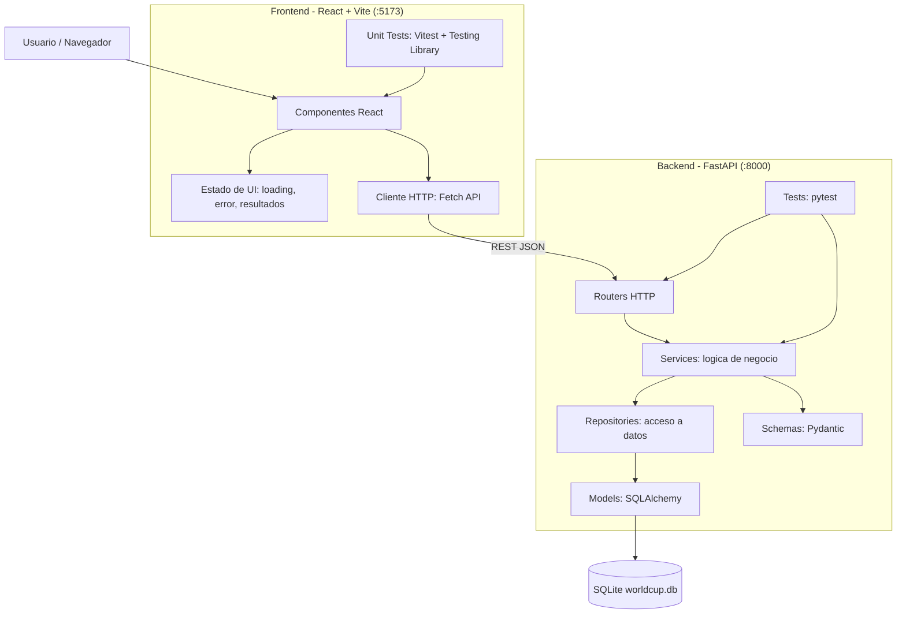

# Arquitectura del Simulador Mundial 2026

Este proyecto implementa un simulador del Mundial 2026 con una arquitectura separada entre backend y frontend.

Originalmente el backend FastAPI servia tanto la API como el HTML desde el mismo servidor. Luego se separo la aplicacion en dos capas independientes:

- Backend FastAPI: API REST, reglas de negocio, persistencia y simulacion del torneo.
- Frontend React + Vite: interfaz visual que consume la API usando `fetch`.

## URLs Locales

Con ambas capas levantadas, la aplicacion queda disponible en:

```text
Backend API: http://127.0.0.1:8000
Swagger:     http://127.0.0.1:8000/docs
Frontend:    http://127.0.0.1:5173
```

## Diagrama de Arquitectura



## Estructura Principal

```text
backend-alumnos/
  main.py
  database.py
  models/
  repositories/
  routers/
  schemas/
  services/
  tests/
  frontend/
    index.html
    package.json
    vite.config.js
    src/
      api/
        worldCupApi.js
      components/
        AppFooter.jsx
        AppHeader.jsx
        Dashboard.jsx
        GroupsResult.jsx
        Hero.jsx
        Knockout.jsx
        LoadingOverlay.jsx
        MatchCard.jsx
        SummaryBar.jsx
        TeamGroups.jsx
      test/
        fixtures.js
        setup.js
      utils/
        groups.js
        tournament.js
      App.jsx
      App.test.jsx
      main.jsx
      styles.css
  ARQUITECTURA.md
  pnpm-workspace.yaml
  requirements.txt
```

## Backend

El backend esta construido con FastAPI y mantiene el patron de capas:

```text
Router -> Service -> Repository -> Model -> Schema
```

Responsabilidades principales:

- Exponer endpoints REST.
- Gestionar equipos y jugadores.
- Simular el Mundial 2026 con 48 equipos.
- Procesar fase de grupos, ronda de 32, octavos, cuartos, semifinales, tercer puesto y final.
- Calcular metricas del dashboard.
- Persistir datos usando SQLite.

Endpoints principales:

- `GET /teams/`
- `POST /simulator/run`
- `GET /metrics/dashboard`
- `GET /metrics/team-scorers`

## Frontend

El frontend esta construido con React + Vite y se encuentra en la carpeta `frontend/`.

Responsabilidades principales:

- Mostrar los equipos organizados por grupos.
- Ejecutar la simulacion del torneo desde un boton principal.
- Renderizar resultados de fase de grupos.
- Renderizar llaves eliminatorias con nombres de fase.
- Mostrar campeon, metricas generales y goleadores por equipo.
- Manejar estados de carga, error y datos vacios.

La estructura del frontend queda separada por responsabilidad:

- `src/App.jsx`: componente contenedor. Coordina estado, carga inicial y ejecucion de la simulacion.
- `src/api/worldCupApi.js`: cliente HTTP y funciones de acceso a la API.
- `src/components/`: componentes visuales reutilizables.
- `src/utils/`: funciones puras auxiliares, como agrupado y conteo de partidos.
- `src/test/`: configuracion y fixtures compartidos para pruebas.

Componentes principales:

- `AppHeader`: barra superior institucional.
- `Hero`: encabezado visual del simulador.
- `TeamGroups`: listado de equipos agrupados.
- `GroupsResult`: tabla de posiciones por grupo.
- `MatchCard`: tarjeta individual de partido.
- `Knockout`: fases eliminatorias.
- `SummaryBar`: resumen de equipos, partidos, goles y campeon.
- `Dashboard`: metricas ejecutivas y goleadores.
- `LoadingOverlay`: estado visual durante la simulacion.
- `AppFooter`: pie institucional.

El frontend consume la API base:

```text
http://127.0.0.1:8000
```

Para permitir la comunicacion local, el backend tiene CORS habilitado para:

```text
http://127.0.0.1:5173
http://localhost:5173
```

## Como Levantar el Proyecto

### 1. Levantar Backend

Desde la raiz del proyecto:

```powershell
cd C:\Users\pedro\Documents\java\backend-alumnos
.\.venv\Scripts\python.exe -m uvicorn main:app --host 127.0.0.1 --port 8000
```

Luego se puede abrir Swagger en:

```text
http://127.0.0.1:8000/docs
```

### 2. Levantar Frontend

En otra consola, desde la raiz del proyecto:

```powershell
cd C:\Users\pedro\Documents\java\backend-alumnos
pnpm --dir frontend dev
```

Luego abrir:

```text
http://127.0.0.1:5173
```

## Como Correr los Tests

### Tests del Backend

Desde la raiz del proyecto:

```powershell
cd C:\Users\pedro\Documents\java\backend-alumnos
.\.venv\Scripts\python.exe -m pytest tests/ -v
```

Este comando ejecuta los tests de FastAPI, servicios, repositorios y reglas de simulacion.

### Tests del Frontend

Desde la raiz del proyecto:

```powershell
cd C:\Users\pedro\Documents\java\backend-alumnos
pnpm --dir frontend test
```

Los tests del frontend usan:

- Vitest como test runner.
- Testing Library para renderizar componentes React.
- jsdom para simular el navegador.
- jest-dom para assertions sobre el DOM.

Componentes cubiertos:

- `TeamGroups`
- `GroupsResult`
- `MatchCard`
- `Knockout`
- `SummaryBar`
- `Dashboard`
- `App`

Los tests estan separados por archivo:

- `src/components/TeamGroups.test.jsx`
- `src/components/GroupsResult.test.jsx`
- `src/components/MatchCard.test.jsx`
- `src/components/Knockout.test.jsx`
- `src/components/SummaryBar.test.jsx`
- `src/components/Dashboard.test.jsx`
- `src/App.test.jsx`

### Tests del Frontend en Modo Watch

Para dejar los tests corriendo mientras se modifica codigo:

```powershell
pnpm --dir frontend test -- --watch
```

## Build del Frontend

Para verificar que el frontend compila para produccion:

```powershell
cd C:\Users\pedro\Documents\java\backend-alumnos
pnpm --dir frontend build
```

El resultado se genera en:

```text
frontend/dist/
```

## Gestion de Dependencias Frontend

Por decision del proyecto, se usa `pnpm` para instalar y ejecutar dependencias del frontend.

No se usa:

```powershell
npm install
```

La configuracion de seguridad esta en:

```text
pnpm-workspace.yaml
```

Esta politica evita instalar paquetes demasiado recientes o dependencias con comportamientos riesgosos sin revision previa.

## Resumen

La aplicacion quedo separada en dos servicios independientes:

- FastAPI concentra API, datos y reglas de negocio.
- React + Vite concentra la experiencia visual y consume la API.

Esta separacion permite trabajar, testear, desplegar y mantener backend y frontend como capas independientes, replicando una arquitectura mas cercana a un proyecto real.
